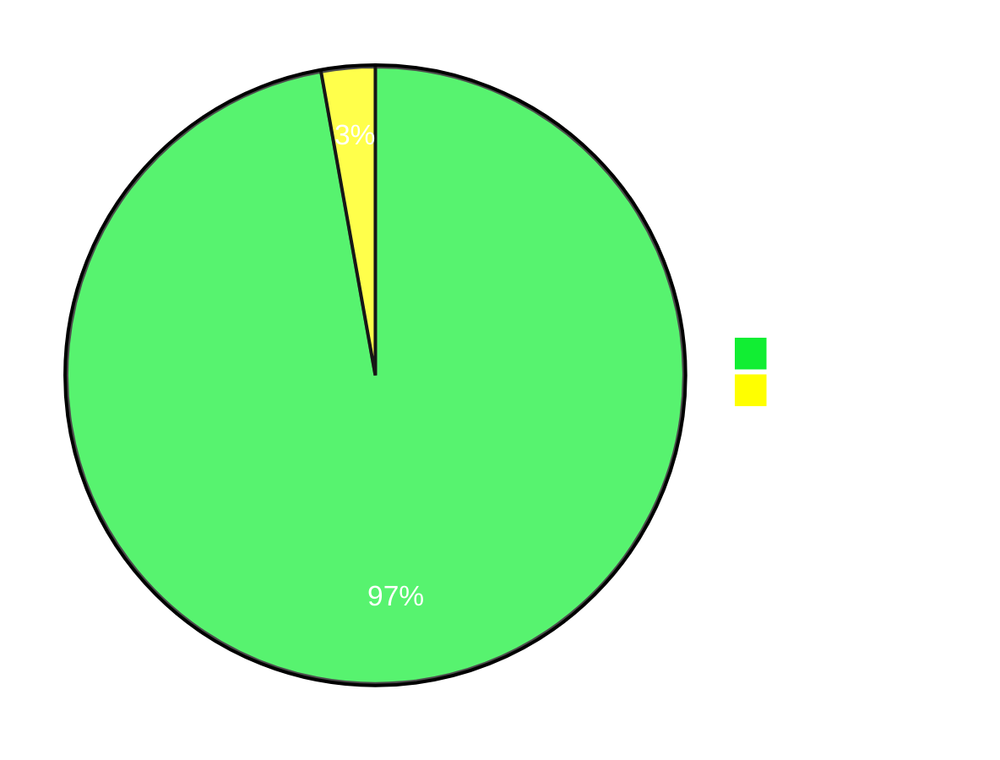

# My Plan for Improving in Programming

1. I divide the entire year into 3 cycles(4 months each)
2. Each cycle comprises of 8 parts(15 days or fortnight)
3. For each part I select one topic in the order below
   1. Trees
   2. Graphs
   3. DP
   4. Back Tracking
   5. Arrays
   6. Strings
   7. Game Theory
   8. Linked List
4. During current topic, the next topic algorithms will be learned
   1. for example, during the 15 days time for Tree topic, I will be spending some time on graph algorithms, this way it saves time when I come to graph topic
5. I will currently restrict myself to 2 platforms(GFG, Leetcode), other platforms are pretty much good. However, I personally believe its better to strengthen my fundamentals in fewer platforms before exploring others.
6. Rules on Problem solving
   1. Min : 3, Max: 10 problems per day
   2. Problem of the day in either platform will not be counted, even though the tag matches with the current topic
   3. Each New Algorithm learnt should be in gh-pages in my own understanding (Yet to start)
7. I will follow this approach for atleast a year and see what are merits and drawbacks it brought based on that I'll improvise on this technique

