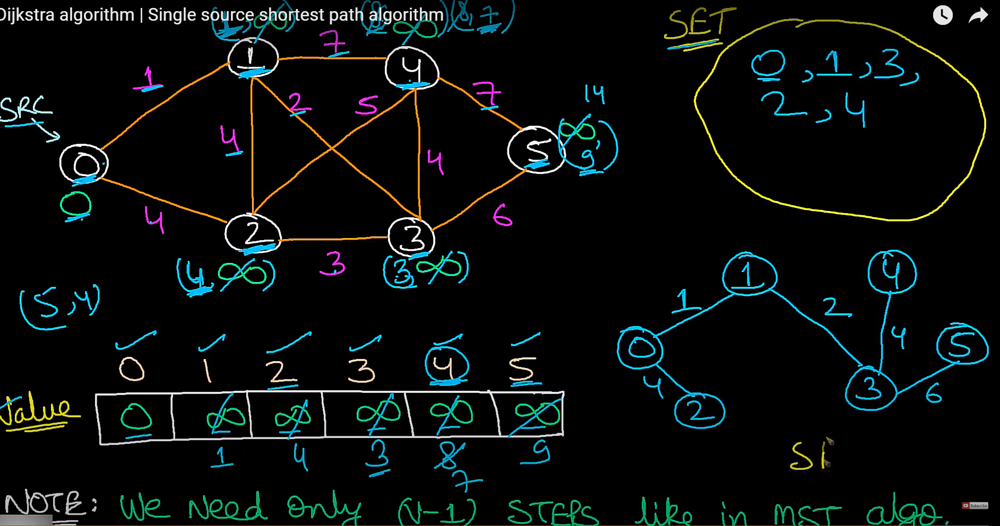

## Introduction

1. It's a greedy Shortest Path Algorithm
2. Helps to find shortest path from source to all vertices

## Applications

1. Network Routing Protocols
2. Transportation Planning
3. Computer Networks

## Limitations

1. It doesn't work for ==Negative weight cycles==.

## Video

- [Youtube Techdose](https://www.youtube.com/watch?v=Sj5Z-jaE2x0&t=227s)

## Algorithm

<ol>
    <li>  Maintain a SET of Processed Nodes </li>
    <li>  Assign all Nodes with distance Value = Infinity </li>
    <li>  Loop: (Until all vertices are Included)
        <ol>
            <li>Pick min value vertex which is not already processed.</li>
            <li>Include this selected Node in Processed Set</li>
            <li>Update all the adjacent Node distances</li>
            <li>Pick min value vertex which is not already processed.</li>
            <li>If (New distance < old distance) then Update Else Skip</li>
        </ol>
    </li>
</ol>

<figure markdown>
  { width="600" }
  <figcaption>Dijkstra's Algorithm</figcaption>
</figure>

### Time Complexity

1. O(V^2) Simple Implementation using Adj Matrix
2. O(ElogV) (Adj List + min heap)

## Implementation (ElogV)

### Java

=== "Adj List, PriorityQueue"

    ``` java linenums="1"
    class Solution
    {
        static int[] dijkstra(int n, ArrayList<ArrayList<ArrayList<Integer>>> adj, int s)
        {
            int[] distances = new int[n];
            Arrays.fill(distances, Integer.MAX_VALUE);
            distances[s] = 0;
            Set<Integer> processed = new HashSet<Integer>();
            Queue<Integer[]> queue = new PriorityQueue<>(new Comparator<Integer[]>(){
                public int compare(Integer[] a, Integer[] b){
                    return Integer.compare(a[1], b[1]);
                }
            });
            queue.add(new Integer[]{s, 0});
            while(processed.size() < n - 1 && queue.size() > 0){
                Integer[] vertex = queue.poll();
                processed.add(vertex[0]);
                for(var v: adj.get(vertex[0])){
                    if(processed.contains(v.get(0))){
                        continue;
                    }
                    if(distances[v.get(0)] > distances[vertex[0]] + v.get(1)){
                        distances[v.get(0)] = distances[vertex[0]] + v.get(1);
                        queue.add(new Integer[]{v.get(0), distances[v.get(0)]});
                    }
                }
            }
            return distances;
        }
    }
    ```

=== "Adj List, TreeSet"

    ``` java linenums="1"
    class Node{
        int index;
        int dist;
        Node(int index,int dist){
            this.index =  index;
            this.dist = dist;
        }
    }
    class Solution
    {
        //Function to find the shortest distance of all the vertices
        //from the source vertex S.
        static int[] dijkstra(int v, ArrayList<ArrayList<ArrayList<Integer>>> adj, int s)
        {
            int result[] = new int[v];
            Node[] o = new Node[v];
            TreeSet<Node> queue = new TreeSet<Node>(new Comparator<Node>(){
                public int compare(Node n1,Node n2){
                    if(n1.dist == n2.dist){
                        return Integer.compare(n1.index,n2.index);
                    }
                    return Integer.compare(n1.dist,n2.dist);
                }
            });
            for(int i = 0; i < v;i++){
                result[i] = Integer.MAX_VALUE;
                int dist = Integer.MAX_VALUE;
                if(i == s){
                    dist = 0;
                }
                o[i] = new Node(i,dist);
            }
            queue.add(o[s]);
            while(!queue.isEmpty()){
                var node = queue.pollFirst();
                result[node.index] = node.dist;
                for(var u: adj.get(node.index)){
                    if(result[u.get(0)] > node.dist + u.get(1)){
                        o[u.get(0)].dist = node.dist + u.get(1);
                        result[u.get(0)] = node.dist + u.get(1);
                        queue.add(o[u.get(0)]);
                    }
                }
            }
            return result;
        }
    }
    ```

### Python

=== "Using Heapq"

    ``` python linenums="1"
    import heapq
    class Solution:
        def dijkstra(self, v, adj, s):
            distances = [float("Inf")] * (v)
            distances[s] = 0
            queue = []
            heapq.heappush(queue, (0, s))
            processed = set()
            while(queue and len(processed) < v - 1):
                dist, vertex = heapq.heappop(queue)
                processed.add(vertex)
                for child, distance in adj[vertex]:
                    if(child in processed):
                        continue;
                    if(distances[child] > distance + dist):
                        distances[child] = distance + dist
                        heapq.heappush(queue, (distances[child], child))
            return distances
    ```

## Practice Problems

- [ ] [Airlines and Railways](https://practice.geeksforgeeks.org/contest/gfg-weekly-coding-contest-102/problems/)
