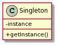

## Introduction

- The term Singleton describes something that has only a single presence in the program.

- You may want to keep only one instance of a particular class simply because it is either expensive to create or it does not make sense to keep more than one for the lifetime of the program.
<ul>
 <li>
    <em> Observations </em>
    <ul>
        <li> <b>Global Access Point </b>: When you have a singleton, you essentially have one and only one access point of its instance. That's why a lot of times you find that the Singleton is just another name for global instance.</li>
        <li><b>The instance is cached somewhere </b>: You cache the instance of the Singleton object somewhere so that you can retrieve it on demand. Typically, you store it within the class instance itself as a static variable, but it can be stored inside <em> inversion of control </em> container</li>
        <li><b>The instance is created on demand</b>: The instance is not created the moment it is declared. Instead, it is created lazily, in a FIFO fashion. This has the benefit of avoiding expensive initializations when starting applications.</li>
        <li><b>Unique instance per class</b>: The instance is unique per class in the sense that different classes have their own singletons</li>
    <ul>
 </li> 
</ul>

## When do we use Singleton Patterns ?

- The Singleton is used to control access to external resources such as database connections, API endpoints, or filesystems. This means you don't want to have two or more objects holding references to those resources without some sort of coordination. Failure to avoid that can lead to having race conditions, increased resource utilization, and integrity issues.

## UML Class Diagram

- The class the is said to be singleton when it contains at least the following signature:

  

- Private variable - instance and public method - getInstance()

## Implementation

### Classic Implementation

- Step: 1 - Private Constructor(goal: Prevent the manual creation of singleton objects)

```typescript
export class Singleton {
	// Prevents creation of new instances

	private constructor() {}
}
```

- Step: 2 - Cached Instance(goal: ensure only one instance per class)

```typescript
export class Singleton {
	// Stores the singleton instance

	private static instance: Singleton;

	// Prevents creation of new instances

	private constructor() {}
}
```

- Step: 3 Single Access(goal: to access cached instance)

```typescript
export class Singleton {
	// Stores the singleton instance

	private static instance: Singleton;

	// Prevents creation of new instances

	private constructor() {}

	// Method to retrieve instance

	static getInstance() {
		if (!Singleton.instance) {
			Singleton.instance = new Singleton();
		}

		return Singleton.instance;
	}
}
```

- **Note:** We created the instance lazily, and when the class is discovered at the the runtime. This is to ensure you avoid any side effects of the instantiation process, such as increased memory usage or calling external services. If this is not strictly required, you may want to eagerly create the instance from the start.

#### Example

```typescript
export class UsersAPISingleton {
	private static instance: UsersAPISingleton;

	private constructor() {}

	static getInstance() {
		if (!UsersAPISingleton.instance) {
			UsersAPISingleton.instance = new UsersAPISingleton();
		}

		return UsersAPISingleton.instance;
	}

	getUsers(): Promise<any> {
		return Promise.resolve(['Alex', 'John', 'Sarah']);
	}
}

const usersPromise = UsersAPISingleton.getInstance().getUsers();

usersPromise.then((res) => {
	console.log(res);
});
```

### Modern Implementation

#### Using Module Resolution Singltons

- Instead of creating your own Singleton implementation and having the class caching this instance, you can leverage the module system loading mechanism.

- Step: 1 - Create a class

```typescript
class ApiServiceSingleton {}
```

- Step: 2 - export default instance variable

```typescript
export default new ApiServiceSingleton();
```

_Note:_ With this appraoch we are delegating the control of the singleton to the module system

_Node Js Module System_

- This module system caches the modules based on the **absolute required path** of this module. example

        /users/sumanth/projects/typescript-4-design-patterns/chapters/chapter-3/ModuleSingleton.ts

- As long as we import this file and it resolves to the same absolute path, then the module system will use the same cached instance

#### Using an Ioc Container

- Using an IoC container is the next alternative way to control Singleton.

```typescript
import 'reflect-metadata';

import { injectable, Container } from 'inversify';

interface UsersApiService {
	getUsers(): Promise<string[]>;
}

let TYPES = {
	UsersApiService: Symbol('UsersApiService'),
};

@injectable()
class UsersApiServiceImpl implements UsersApiService {
	getUsers(): Promise<string[]> {
		return Promise.resolve(['Alex', 'John', 'Sarah']);
	}
}

const container = new Container();

container

	.bind<UsersApiService>(TYPES.UsersApiService)

	.to(UsersApiServiceImpl)

	.inSingletonScope();

container

	.get<UsersApiService>(TYPES.UsersApiService)

	.getUsers()

	.then((res) => console.log(res));
```

## Criticisms

- **Global Instance Pollution:** They are problematic to test or to mock, and using global variables means ignoring any flexibility you can get from interfaces or other abstractions.
- **Hard to get right**: The singleton is hard to implement, especially if you plan for testability and lazy initialization, and want to use it as a global variable.
